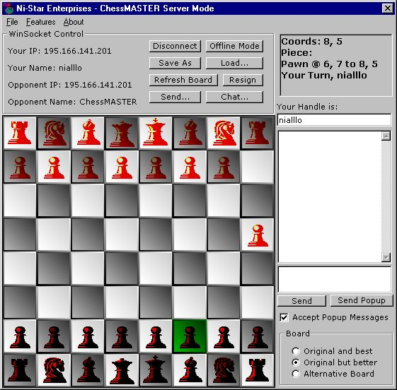



## ChessMASTER

### Description

ChessMASTER version 1 is a fully fuctional internet chess game. Offline you can play two player or the in-built artifiscal inteligence engine. The chess pieces are drawn with a variable translucency, including transparent backgrounds. Online you can chat and send popup messages in the Game or using the ChessMaster website. You can save the board at any time and reload it to view (& theorize) or to play the computer on. Three boards are included (one 'borrowed' from RJSoftChess) and are saved as resources.
 
### More Info
 

             |
---                |---
**Submitted On**   |2000-12-07 12:22:00
**By**             |[Niall Mooney](https://github.com/Planet-Source-Code/PSCIndex/blob/master/ByAuthor/niall-mooney.md)
**Level**          |Advanced
**User Rating**    |4.4 (83 globes from 19 users)
**Compatibility**  |VB 6\.0
**Category**       |[Games](https://github.com/Planet-Source-Code/PSCIndex/blob/master/ByCategory/games__1-38.md)
**World**          |[Visual Basic](https://github.com/Planet-Source-Code/PSCIndex/blob/master/ByWorld/visual-basic.md)
**Archive File**   |[CODE\_UPLOAD1219611302000\.zip](https://github.com/Planet-Source-Code/niall-mooney-chessmaster__1-13219/archive/master.zip)

